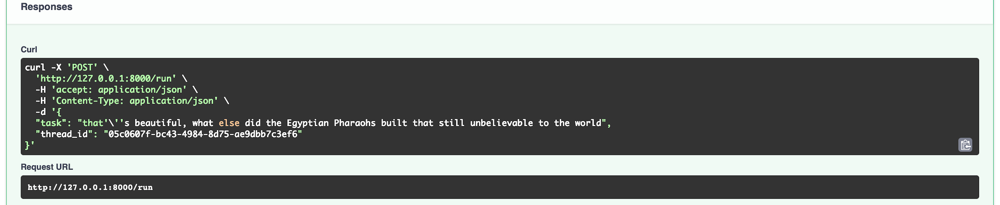
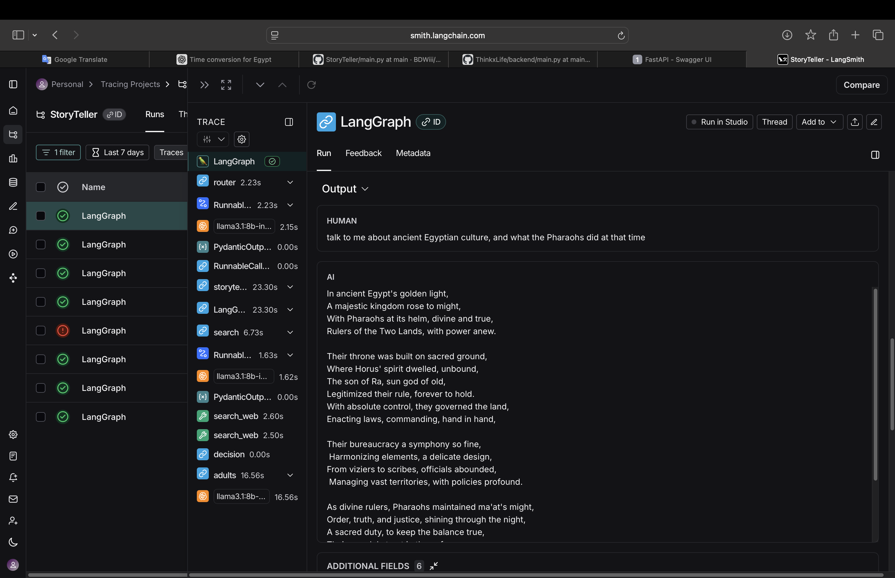

🎭 Storyteller chatbot

When stories rhyme, hearts listen. When art speaks, awareness grows.

---
✨ Overview

This project is more than a chatbot — it’s an artistic agent designed to raise awareness through storytelling. By weaving poetic narratives around important topics, the agent captures attention in a way that facts alone often cannot.
The challenge today isn’t access to knowledge — it’s attention. People scroll, skim, and move on. But when information is delivered as a story — short rhymes for children, or rich poetic verses for adults — it becomes memorable, emotional, and engaging.
This agent uses two voices:
📖 Adults Mode — thoughtful poetic storytelling that entertains while teaching.
🧸 Kids Mode — gentle rhymes, simple language, short verses.
Even in casual chat, the agent can respond in poetic tones — turning every conversation into a moment of art.

---
🧩 How It Works

At its core, the agent combines:
-Router Node → Chooses between chatting and storytelling.
-Chat Node → Engages in poetic conversation, keeping track of history.
-Storyteller Node →
Searches the web for relevant content.
Crafts a story tuned to age (kids/adults).
Returns a poetic narrative enriched with real-world knowledge.
The storytelling sub-agent uses retrieval and structured prompts to ensure the stories are not only creative but also informed.
🎨 Why This Matters
Art as a Bridge → People may ignore raw information, but art pulls them in.
Education Through Entertainment → Kids learn best when engaged through stories.
Awareness That Lasts → Poetry lingers longer in memory than plain prose.
This project imagines a world where awareness campaigns, educational tools, and everyday conversations can be wrapped in art.
---
🚀 Features

Dual storytelling modes (Kids / Adults).
Conversational memory with poetic replies.
Web-integrated storytelling: grounded in facts, elevated by art.
API-ready (FastAPI backend).
State management with persistence (SQLite checkpoints).
---
⚡ Usage



Response:
```json
{
  "story": "A poetic story about ancient Egypt...",
  "thread_id": "123e4567-e89b-12d3-a456-426614174000"
}
```
---
Overview example


---
🔮 Roadmap
 - Add multimodal storytelling (image + text).
 - Expand poetic “chat” mode with stylistic variations.
 - Integrate voice narration for immersive experience.
 - Provide plugins for awareness campaigns and classrooms.
 ---
🤝 Contributing
Contributions are welcome — whether you’re a developer, poet, artist, or activist. Together, we can make awareness as engaging as art itself.